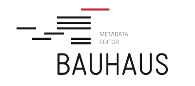

# Bauhaus

Web application for the management of concepts, classifications and other statistical objects.

[](https://github.com/InseeFr/Bauhaus/actions/workflows/ci.yml)
[](https://sonarcloud.io/dashboard?id=InseeFr_Bauhaus)
[](https://sonarcloud.io/dashboard?id=InseeFr_Bauhaus)
[](https://opensource.org/licenses/MIT)

The documentation can be found in the [documentation folder](https://github.com/InseeFr/Bauhaus/tree/main/documentation/src/content/docs) and [browsed online](https://inseefr.github.io/Bauhaus).

## How to start

The application is tested on Node.js 22.

```
git clone git@github.com:InseeFr/Bauhaus.git
cd Bauhaus
npm install
npm run start
```

You can run all tests suites with this command. You need to run at least once `npm run build`.

```shell
npm run test:coverage
```

The following command will activate the **watch** mode, and you will be able to select a subset of tests you want to run.

```shell
npm run test --watchAll
```

## Docker

You can also run the application thanks to **Docker**

```shell
docker build -t bauhaus:front .
docker run -it -p 8080:8080 bauhaus:front
```

## Issues

If you are using, you should install the following dependency.

```
npm install --global windows-build-tools

```
