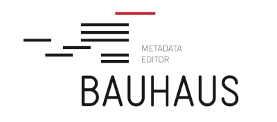

# Bauhaus

Web application for the management of concepts, classifications and other statistical objects.

The documentation can be found in the [docs](https://github.com/InseeFr/Bauhaus/tree/master/docs) folder and [browsed online](https://inseefr.github.io/Bauhaus).

[Storybook](https://inseefr.github.io/Bauhaus/storybook) is also available online.
