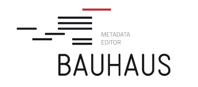

# Bauhaus

Web application for the management of concepts, classifications and other statistical objects.

[](https://github.com/InseeFr/Bauhaus/actions/workflows/ci.yml)
[](https://sonarcloud.io/dashboard?id=InseeFr_Bauhaus)
[](https://sonarcloud.io/dashboard?id=InseeFr_Bauhaus)
[](https://opensource.org/licenses/MIT)

The documentation can be found in the [documentation folder](https://github.com/InseeFr/Bauhaus/tree/main/documentation/src/content/docs) and [browsed online](https://inseefr.github.io/Bauhaus).

## How to start

The application is tested on Node.js 22.

```
git clone git@github.com:InseeFr/Bauhaus.git
cd Bauhaus
pnpm install
pnpm start
```

You can run all tests suites with this command. You need to run at least once `npm run build`.

```shell
pnpm test:coverage
```

The following command will activate the **watch** mode, and you will be able to select a subset of tests you want to run.

```shell
pnpm test --watchAll
```

## Docker

You can also run the application thanks to **Docker**

```shell
docker build -t bauhaus:front .
docker run -it -p 8080:8080 bauhaus:front
```

## Generated DDI 4 types

The TypeScript types under `src/packages/modules-ddi/physical-instances/types/generated/`
are generated automatically from `src/schemas/ddi-schema.json` (DDI Lifecycle 4.0 RC1)
by `scripts/generate-ddi-types.ts`.

Generation is wired into `vite.config.ts` (plugin `ddi-types-generator`) and runs:

- on `pnpm start` (dev server startup);
- on every `pnpm build`;
- automatically whenever `src/schemas/ddi-schema.json` changes while the dev server
  is running.

The `generated/` directory is gitignored; only the source schema is versioned.

### Updating the schema

`src/schemas/ddi-schema.json` is a **manual copy** of
`Bauhaus-Back-Office/module-bauhaus-bo/src/main/resources/ddi-schema.json`. There is
no automatic synchronisation for now.

To pull a schema update from the back-office:

```shell
cp ../Bauhaus-Back-Office/module-bauhaus-bo/src/main/resources/ddi-schema.json \
   src/schemas/ddi-schema.json
```

The next `pnpm start` or `pnpm build` will regenerate `generated/ddi.ts`
automatically. If the dev server is already running, the watcher picks up the change
and regenerates without a restart.

To regenerate manually:

```shell
node --experimental-strip-types scripts/generate-ddi-types.ts
```

## Issues

If you are using, you should install the following dependency.

```
pnpm install --global windows-build-tools

```
