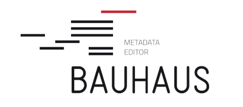

# Bauhaus

Web application for the management of concepts, classifications and other statistical objects.

[](https://github.com/InseeFr/Bauhaus/actions/workflows/quality.yml)
[](https://sonarcloud.io/dashboard?id=InseeFr_Bauhaus)
[](https://sonarcloud.io/dashboard?id=InseeFr_Bauhaus)
[](https://opensource.org/licenses/MIT)

The documentation can be found in the [documentation folder](https://github.com/InseeFr/Bauhaus/tree/main/documentation/src/content/docs) and [browsed online](https://inseefr.github.io/Bauhaus).

## How to start

The application is tested on Node.js 22.

```
git clone git@github.com:InseeFr/Bauhaus.git
cd Bauhaus
pnpm install
pnpm start
```

You can run all tests suites with this command. You need to run at least once `npm run build`.

```shell
pnpm test:coverage
```

The following command will activate the **watch** mode, and you will be able to select a subset of tests you want to run.

```shell
pnpm test --watchAll
```

## Docker

You can also run the application thanks to **Docker**

```shell
docker build -t bauhaus:front .
docker run -it -p 8080:8080 bauhaus:front
```

## Generated DDI 4 types

The TypeScript types under `src/packages/modules-ddi/physical-instances/types/generated/`
are generated automatically from `src/schemas/ddi-schema.json` (DDI Lifecycle 4.0 RC1)
by `scripts/generate-ddi-types.ts`.

Generation is wired into `vite.config.ts` (plugin `ddi-types-generator`) and runs:

- on `pnpm start` (dev server startup);
- on every `pnpm build`;
- automatically whenever `src/schemas/ddi-schema.json` changes while the dev server
  is running.

The `generated/` directory is gitignored; only the source schema is versioned.

### Updating the schema

`src/schemas/ddi-schema.json` is a **manual copy** of
`Bauhaus-Back-Office/module-bauhaus-bo/src/main/resources/ddi-schema.json`. There is
no automatic synchronisation for now.

To pull a schema update from the back-office:

```shell
cp ../Bauhaus-Back-Office/module-bauhaus-bo/src/main/resources/ddi-schema.json \
   src/schemas/ddi-schema.json
```

The next `pnpm start` or `pnpm build` will regenerate `generated/ddi.ts`
automatically. If the dev server is already running, the watcher picks up the change
and regenerates without a restart.

To regenerate manually:

```shell
node --experimental-strip-types scripts/generate-ddi-types.ts
```

## Forms

### Showing back-office validation errors next to the fields

When a save is rejected with a validation error, the back-office answers with a 400 whose
body lists the faulty fields:

```json
{ "message": "…", "errors": [{ "field": "prefLabelLg1", "message": "must not be blank" }] }
```

Every edition screen must display these errors **under the matching input, like a
client-side error**, and keep everything else in the error banner. Two screens already do
it and serve as reference: `OperationsFamilyEdition.tsx` (the simplest) and
`OperationsIndicatorEdition.tsx`.

The SDK rejects with that body (plus `status`), never with an `Error`: do not test
`instanceof Error`, hand the rejection to `toFormErrors` (`@utils/api-errors`).

#### Recipe

1. **List the field names.** Compare the fields of the back-office DTO (`XxxRequest`)
   with the keys of `clientSideErrors.fields` on the screen. Only fields whose name is
   identical get an error slot; nested or renamed fields (`temporal.startDate`,
   `altLabelLg1[0]`) stay in the banner, or go through a local mapping table. Never rename
   anything on the back-office side.

2. **Red: write the test first**, in the screen spec:

   ```tsx
   it("should display a server field error next to its field, like a client-side error", async () => {
     OperationsApi.updateFamily.mockRejectedValueOnce({
       status: 400,
       errors: [{ field: "prefLabelLg1", message: "must not be blank" }],
     });
     renderWithAppContext(<OperationsFamilyEdition {...defaultProps} />);
     clickSave();

     const input = await screen.findByDisplayValue("Test Label 1");
     await waitFor(() => expect(input).toHaveAccessibleDescription("must not be blank"));
     expect(input).toHaveAttribute("aria-invalid", "true");
   });
   ```

   It must fail on the assertion, not on an import or a type error.

3. **Green: call `toFormErrors` in the rejection of the save.** Declare the fields that
   own an error slot, then split the rejection:

   ```tsx
   const FIELDS_WITH_ERROR_SLOT = ["prefLabelLg1", "prefLabelLg2"];

   OperationsApi[method](state.family).then(onSuccess, (err: unknown) => {
     const { clientSideErrors, serverSideError } = toFormErrors(err, FIELDS_WITH_ERROR_SLOT);
     if (clientSideErrors) {
       dispatch({ type: "SET_SUBMITTING", payload: true });
       dispatch({ type: "SET_CLIENT_ERRORS", payload: clientSideErrors });
     }
     dispatch({ type: "SET_SERVER_ERROR", payload: serverSideError });
   });
   ```

   `clientSideErrors` is `null` when no error targets a displayed field: the rejection is
   then left untouched in `serverSideError`, and the screen behaves exactly as before
   (500, 409, business error message…).

4. **Give each listed field its slot**: `aria-invalid`, and an `aria-describedby` pointing
   to a `ClientSideError` with the matching `id`.

   ```tsx
   <TextInput
     id="prefLabelLg1"
     aria-invalid={!!state.clientSideErrors.fields?.prefLabelLg1}
     aria-describedby={
       state.clientSideErrors.fields?.prefLabelLg1 ? "prefLabelLg1-error" : undefined
     }
   />
   <ClientSideError id="prefLabelLg1-error" error={state.clientSideErrors?.fields?.prefLabelLg1} />
   ```

   A component that does not forward `aria-describedby` (`Select`, `CreatorsInput`) still
   gets its `ClientSideError` under it; the test then asserts on the text.

5. **Always render `<ErrorBloc error={state.serverSideError} />`.** It ignores an empty
   value and prints one line per remaining error (`created : is not a valid LocalDate`).
   This fallback guarantees that no message is ever lost: a field without a slot, a
   misspelt name or an error on the whole body (`field: "body"`) ends up in the banner.
   Cover it with a second test:

   ```tsx
   it("should display in the error banner a server error on a field absent from the form", async () => {
     OperationsApi.updateFamily.mockRejectedValueOnce({
       status: 400,
       errors: [{ field: "created", message: "is not a valid LocalDate" }],
     });
     renderWithAppContext(<OperationsFamilyEdition {...defaultProps} />);
     clickSave();

     expect(await screen.findByText("created : is not a valid LocalDate")).toBeInTheDocument();
   });
   ```

6. **Check it for real** once the endpoint is validated on the back-office side
   (`@Valid @RequestBody`): add a temporary `@Size(max = 3)` on a DTO field, save the form
   with a longer value, check that the message appears under the input, then remove the
   constraint.

## Issues

If you are using, you should install the following dependency.

```
pnpm install --global windows-build-tools

```
