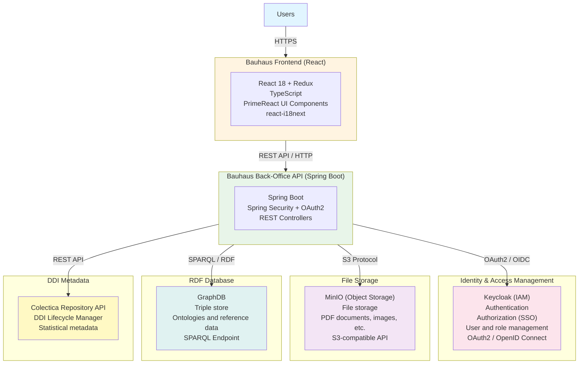

## Overview

Bauhaus is a modern web application built with React that communicates with a backend services ecosystem to manage statistical metadata and documents.

## Architecture Diagram

## Main Components

### Frontend - Bauhaus

React single-page application (SPA) that provides the user interface for managing statistical metadata.

**Key Technologies:**
- React 18 with Redux for state management
- TypeScript for type safety
- PrimeReact for UI components
- Vite as bundler

[React Documentation](https://react.dev/) | [Redux Documentation](https://redux.js.org/)

### Backend - Spring Boot API

REST API that orchestrates all backend services and exposes business functionalities.

**Responsibilities:**
- Orchestration of calls to different services
- Business logic
- Data validation and transformation
- Security management

[Spring Boot Documentation](https://spring.io/projects/spring-boot)

### Security - Keycloak

Identity and Access Management (IAM) server that secures the entire stack.

**Features:**
- Single Sign-On (SSO)
- User and role management
- OAuth2 and OpenID Connect protocols
- Identity federation

[Keycloak Documentation](https://www.keycloak.org/documentation)

### File Storage - MinIO

S3-compatible object storage server for managing documents and files.

**Use Cases:**
- PDF document storage
- Images and graphics
- Data files
- Amazon S3-compatible API

[MinIO Documentation](https://min.io/docs/minio/linux/index.html)

### RDF Database - GraphDB

Triple store for storing and querying semantic data.

**Use Cases:**
- Ontology storage
- Metadata reference data
- Semantic relationships
- SPARQL queries

[GraphDB Documentation](https://graphdb.ontotext.com/documentation/)

### DDI Metadata - Colectica Repository

Statistical metadata manager based on the DDI (Data Documentation Initiative) standard.

**Features:**
- Metadata lifecycle management
- DDI Lifecycle standard support
- Metadata versioning
- REST API for programmatic access

[Colectica Documentation](https://www.colectica.com/) | [DDI Standard](https://ddialliance.org/)

## Data Flows

### Authentication

1. User accesses Bauhaus Frontend
2. Redirect to Keycloak for authentication
3. Keycloak validates credentials and issues a JWT token
4. Frontend stores the token and sends it with each API request
5. Spring Boot backend validates the token with Keycloak

### Metadata Retrieval

1. Frontend makes a REST request to the backend
2. Backend queries:
   - **GraphDB** for reference data and classifications (via SPARQL)
   - **Colectica** for DDI metadata (via REST API)
3. Backend aggregates and transforms the data
4. JSON response returned to the frontend

### Document Management

1. Document upload from the frontend
2. Backend validates and processes the file
3. File storage in **MinIO** via S3 API
4. Document metadata stored in GraphDB
5. Reference returned to the frontend

## Learn More

- [Getting Started](./getting-started) - Developer getting started guide
- [Colectica Integration](./colectica) - Colectica Repository integration
- [Bauhaus Back-Office](https://github.com/InseeFr/Bauhaus-Back-Office) - Backend GitHub repository
