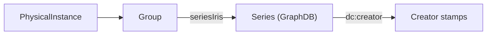

The Variables module is protected by the same RBAC machinery as the rest of Bauhaus — see [Roles & Permissions](/Bauhaus/guides/rbac/) for the general rules. What is specific to this module is **how ownership of a data file is established**, since none of its objects lives in GraphDB and none carries a stamp of its own.

## One module, five privileges

Every endpoint is guarded by the module `DDI_PHYSICALINSTANCE`, written `ddi_physicalinstance` in `rbac.yml`, with the usual privileges `create`, `read`, `update`, `delete`, `publish`.

The privileges are not distributed the way the object hierarchy might suggest — everything the module exposes, groups and study units included, is guarded by that single module:

| Privilege | What it guards |
|-----------|----------------|
| `read` | Every listing and detail endpoint — physical instances, groups, study units, code lists, usages, conversions, schema |
| `create` | Creating a physical instance, creating or updating a study unit |
| `update` | `PATCH` and `PUT` on a physical instance |
| `publish` | `POST /ddi/validate` |
| `delete` | Nothing today — no endpoint of the module checks it. Deleting a variable is a local edit, saved through `update`. |

## How a data file gets a stamp

Under the `STAMP` strategy, Bauhaus needs to know who owns the object being accessed. A physical instance has no owner of its own, so the module resolves one by following the link back into the Operations module:

1. Resolve the physical instance's parent **group**
2. Read the group's `seriesIris` — the IRIs of the Bauhaus series it mirrors
3. Query GraphDB for the **creators** of those series
4. Normalise the resulting organisation stamps

A user may act on the data file when one of their own stamps appears in that set. The same chain is used for listing (filtering out what the user does not own) and for the point checks on writes, so a data file that disappears from the list is also refused on write.

Groups carry the `seriesIris` that make this possible; a group linked to no series resolves to an empty stamp set, and is therefore invisible under `STAMP`.

## Where the strategy is applied

Two mechanisms coexist, because they answer different questions.

**Listings filter their results.** `GET /ddi/physical-instance`, `GET /ddi/physical-instance/search` and `GET /ddi/group` look up the user's `READ` strategy: under `STAMP` they return only the rows whose group resolves to one of the user's stamps, otherwise the full list. Resolution is memoised per group within a request, not per row — a series' creators are looked up once, however many data files it has.

**Creation checks the target.** A physical instance does not exist yet when it is created, so there is nothing to stamp-check on the object. Instead, `POST /ddi/physical-instance` checks `CREATE` against the **group** named in the request body, identified as `groupAgency|groupId`.

The interface mirrors this: the create button is shown as soon as the `CREATE` strategy is not `NONE`, and the actual restriction happens in the group selector of the creation dialog, which is fed by the already-filtered `GET /ddi/group`.

## Roles granted by default

| Role | Strategy |
|------|----------|
| `Gestionnaire_variables_RMESGNCS` | `STAMP` on every privilege |
| `Betatest_OeDDIp_RMESGNCS` | `ALL` on every privilege |
| `Administrateur_RMESGNCS` | `ALL` on every privilege |

See [Grant Access to the Variables Module](/Bauhaus/guides/variables/how-to/grant-access/) to change that.

## Endpoints outside RBAC

The `/ddi/public/…` routes are annotated `@PublicEndpoint`: they require no authentication at all. They serve read-only DDI documents to external consumers — items, code lists, the data files of an operation — and are routed to Bauhaus by the API gateway on the `/ddi/` prefix. See [API Endpoints](/Bauhaus/guides/variables/reference/api-endpoints/).
