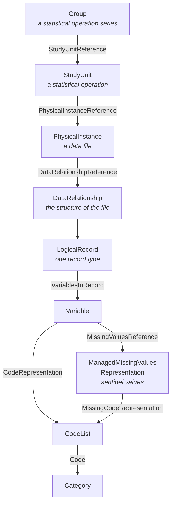

The Variables module manipulates a fixed hierarchy of DDI objects. Understanding it explains most of the module's behaviour: why creating a data file also creates two other objects, why a code list belongs to a group rather than to a variable, and why some data files are visible to you and others are not.

## The hierarchy

| Object | What it represents |
|--------|--------------------|
| `Group` | A statistical operation **series**. Carries `seriesIris`, the IRIs of the Bauhaus series it mirrors. |
| `StudyUnit` | A statistical **operation**. Carries `operationIri`, the IRI of the Bauhaus operation it mirrors. |
| `PhysicalInstance` | A **data file** — the object users create and edit in the module. |
| `DataRelationship` | The structure of that file. One per physical instance, created with it. |
| `LogicalRecord` | One record type inside the structure, holding the list of variables. |
| `Variable` | One column of the file, with a name, labels, and a representation. |
| `CodeList` / `Category` | The permitted values of a coded variable, and the meaning of each. |
| `ManagedMissingValuesRepresentation` | A reusable set of **sentinel values** (missing-value codes) attached to a variable. |

## Creating a data file creates three objects

The physical instance alone would carry no variables: DDI requires the chain `PhysicalInstance → DataRelationship → LogicalRecord` before a variable can exist. So the creation dialog, which only asks for a label, a group and a study unit, actually writes three objects — the physical instance, its data relationship, and its logical record — the latter two labelled after the physical instance.

The same is true of duplication: duplicating a data file duplicates the whole chain, with fresh identifiers.

## Schemes: where objects are filed

Colectica does not let items float. Every code list, category and variable must be filed under a *scheme*, and every scheme under a `LogicalProduct`. The module applies a fixed placement rule, and applies it automatically when you save.

| Object saved | Filed under | Which belongs to |
|--------------|-------------|------------------|
| CodeList | `CodeListScheme` | the parent **Group** |
| Category | `CategoryScheme` | the parent **Group** |
| ManagedMissingValuesRepresentation | `ManagedRepresentationScheme` | the parent **Group** |
| Variable | `VariableScheme` | the parent **StudyUnit** |

Code lists and categories sit at the **group** level because that is the scope over which they are meant to be reused: several data files of the same series can point at the same list. Variables sit at the **study unit** level because they describe one operation's files.

If a required scheme does not exist yet, the save creates it — along with a `LogicalProduct` to hold it when the group or study unit has none. All the schemes created for a given group are filed under a *single* logical product, so a group never ends up with its code list scheme and its category scheme in two different branches.

Everything a save touches — the physical instance, its variables, the new lists and categories, the schemes that had to be provisioned, and the parent items that had to be updated to reference them — is written to Colectica in **one atomic batch**.

## Identity: agency, identifier, version

Every DDI item is identified by a triple, which is why almost every route in the module carries an agency and an identifier:

- **Agency** — the organisation responsible for the item, `fr.insee` by default (`defaultAgencyId`)
- **Identifier** — a UUID
- **Version** — an integer, incremented by Colectica on each write

The canonical form is a URN: `urn:ddi:fr.insee:586a6306-c67d-4fda-a0ce-7e96564bda58:1`.

An item's label is *not* part of its identity. Renaming a code list does not create a new one — see [Code Lists and Categories](/Bauhaus/guides/variables/explanation/code-lists-and-categories/).

## The link back to Operations

`Group.seriesIris` and `StudyUnit.operationIri` are the only bridge between DDI metadata and the rest of Bauhaus. They are what make it possible to:

- decide who owns a data file, by resolving the creators of the group's series in GraphDB — see [Access Control](/Bauhaus/guides/variables/explanation/access-control/)
- serve `GET /ddi/public/operation/{id}/fichiers`, which answers "which data files document this operation?" by matching the operation IRI against the study units

Those IRIs point at the **publication** repository (`http://id.insee.fr/…`), so only published series and operations can be matched.
