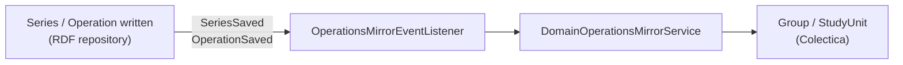

Statistical series and operations live in the RDF repository. They also have a counterpart in the DDI repository, where they act as the containers everything else hangs from: a series is a `Group`, an operation a `StudyUnit`. The **operations mirror** keeps the second in step with the first.

It is off by default, behind `fr.insee.rmes.bauhaus.colectica.operations-mirror.enabled`. For the field-by-field contract, see [Operations Mirror Mapping](/Bauhaus/guides/variables/reference/operations-mirror-mapping/).

## Why an event, and not a method call

The obvious design is to call `GroupService` from the code that writes a series. It was rejected: the Operations domain would then depend on the DDI module, against the dependency direction the project already has (`module-ddi` → `module-operation`) and against the ArchUnit rule that forbids it.

Instead, the RDF write path publishes two records — `SeriesSaved` and `OperationSaved` — that describe **only a series or an operation**: an IRI, an identifier, labels. They know nothing about DDI and have no reason to change when DDI does. All the knowledge of the correspondence lives on the other side, in `operations_mirror`, as an anti-corruption layer.

One consequence is easy to miss: **the feature flag gates the listener, not the publisher**. With the flag off, `OperationsMirrorConfiguration` declares no bean and nobody listens. The RDF write path has not a single condition to evaluate, and turning the mirror on or off never touches it.

## Why identifiers derived from the IRI

Every DDI identifier is a UUID computed from the publication IRI of the RDF resource it mirrors (`UUID.nameUUIDFromBytes`, i.e. a version 3 UUID). Three consequences, all of them intended:

- **Creation and update take the same path.** Rewriting an object whose identifier is already taken replaces it (`RegisterOrReplace`), so there are not two cases to distinguish and no second branch to test.
- **Replaying a synchronisation leaves no duplicate.** This is what makes enabling the flag late harmless, and recovery after an outage trivial: saving the series again is enough.
- **An object is addressable without a search.** Finding the `Group` of a series means computing a UUID, not sweeping the repository.

The version, on the other hand, is never bumped: the mirror reads the existing object and rewrites **its** version. Correcting a label must not create a new version of a DDI object.

## The IRI stored as `UserID`, and why it matters

The publication IRI is written into the object's `r:UserID` of type `URI`. This is not a convenience for traceability — it is **the key that resolves permissions**. A `Group` carries the `seriesIris` from which owner stamps are derived, exactly as described in [Access Control](/Bauhaus/guides/variables/explanation/access-control/).

A `Group` that loses its `UserID` does not become less documented: it becomes **invisible** to the users of that series under the `STAMP` strategy, and no error is raised. That is why the mirror merges IRIs instead of replacing them — a group may carry several, and saving one series must not carry the others away.

## The main pitfall: reading less than you rewrite

Updating a Colectica object works on the **whole** object: read it, change one field, write it all back. So **anything the reading parser does not return is erased from the object**.

The flaw is treacherous because a service test does not catch it: the test builds a complete `Ddi4Group` by hand and checks that the service preserves it — which it does. It is the read port that returns a truncated object. Four such losses were fixed when the mirror was introduced: `LogicalProductReference` and titles beyond the first in `ColecticaGroupSetReader`, `AlternateTitle` in `Lifecycle33ToDdi4.readCitation` (used by `ColecticaSchemeFiler`, which re-registers the `Group` every time a scheme is filed), and the other `UserID`s in the mirror itself.

Hence the rule: **before adding a field to a DDI object written back to Colectica, check that the read paths return it**, and cover the round trip with a test on the parser, not only on the service.

## Blocking, and its limit

A DDI repository failure fails the request that triggered it, rather than being logged and forgotten. The choice is deliberate: a silent divergence between the two repositories costs more than a visible error, because it surfaces much later and on an unrelated screen.

The mode has a limit worth knowing. The RDF write path has no surrounding transaction: the event is published **after** the triples are written. On a Colectica failure the caller does get an error, but the series already exists on the RDF side. The two repositories then diverge until the next save — which idempotency makes enough to catch up.

Making the whole thing truly atomic would require a transaction on `RepositoryGestion`, which does not exist today.

## Coexistence with the local seeding

[Seeding a local repository](/Bauhaus/guides/variables/how-to/seed-a-local-repository/) creates **five `Group` variants per series**, with distinct labels, to exercise sorting — and all of them carry the same `UserID`. The mirror adds its own canonical object alongside.

The two mechanisms therefore write different objects for the same series. They are not meant to run together anywhere but on a disposable environment.
